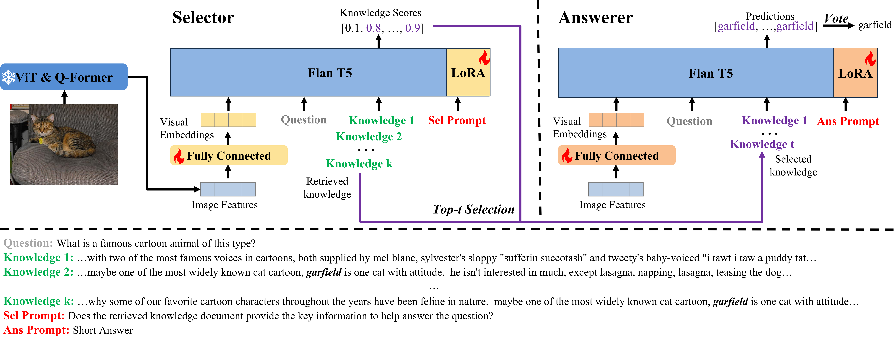

# Self-Bootstrapped Visual-Language Model for Knowledge Selection and Question Answering [EMNLP'24]

By Dongze Hao, Qunbo Wang, Longteng Guo, Jie Jiang and Jing Liu

## Introduction

While large pre-trained visual-language models have shown promising results on traditional visual question answering benchmarks,
 it is still challenging for them to answer complex VQA problems which requires diverse world knowledge. 
 Motivated by the research of retrieval-augmented generation in the field of natural language processing, 
 we use Dense Passage Retrieval (DPR) to retrieve related knowledge to help the model answer questions. 
 However, DPR conduct retrieving in natural language space, which may not ensure comprehensive acquisition of image information. 
 Thus, the retrieved knowledge is not truly conducive to helping answer the question, affecting the performance of the overall system. 
 To address this issue, we propose a novel framework that leverages the visual-language model to select the key knowledge retrieved by DPR and answer questions.
  The framework consists of two modules: Selector and Answerer, where both are initialized by the MLLM and parameter-efficiently finetuned by self-bootstrapping: 
  find key knowledge in the retrieved knowledge documents using the Selector, and then use them to finetune the Answerer to predict answers; 
  obtain the pseudo-labels of key knowledge documents based on the predictions of the Answerer and weak supervision labels, 
  and then finetune the Selector to select key knowledge; repeat. Our framework significantly enhances the performance of the 
  baseline on the challenging open-domain Knowledge-based VQA benchmark, OK-VQA, achieving a state-of-the-art accuracy of 62.83%.

## Architecture



## Setup and Dependencies

```bash
conda create -n lavis python=3.8
conda activate lavis

git clone https://github.com/haodongze/Self-KSel-QAns.git
cd Self-KSel-QAns
pip install -e .
```

## Getting Started
### Prepare data
1. Download the data from [here](https://drive.google.com/file/d/1NkBO3b5m0rbbWGnVnJX-xczTPebJp2zS/view?usp=sharing)
2. Download the images of corresponding datasets
3. Change the local path of lavis/configs/datasets/*

### Train the model
1. okvqa
```bash
bash run_scripts/blip2/train/train_okvqa_flant5xl_select.sh
```
2. fvqa
```bash
bash run_scripts/blip2/train/train_fvqa_flant5xl_select.sh
```
3. aokvqa
```bash
bash run_scripts/blip2/train/train_aokvqa_flant5xl_select.sh
```
## Checkpoints
We have uploaded the checkpoints of lora and fc layer on OKVQA in huggingface https://huggingface.co/echohao1996/Self-KSel-QAns/tree/main

When loading, please note that you need to load the original q-former parameters first.

##  Acknowledgements

This code is reimplemented as a fork of [salesforce/LAVIS][1]

[1]: https://github.com/salesforce/LAVIS
